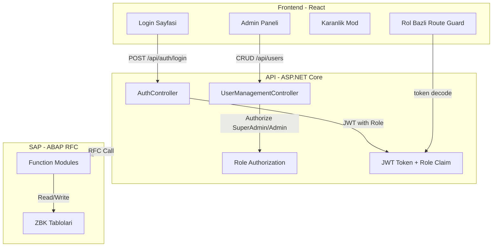

# Stok Takip Sistemi - Rol Yapisi, Karanlik Mod ve Mimari Iyilestirmeler

## Mevcut Durum Ozeti

### API (ASP.NET Core)
- JWT tabanli kimlik dogrulama, token'da `ClaimTypes.Role` mevcut
- 3 rol seed edilmis: `Admin(1)`, `WarehouseManager(2)`, `Manager(3)`
- Controller'larda `[Authorize(Roles = "...")]` ile yetkilendirme zaten var
- Register endpoint'i `[AllowAnonymous]` -- herkes kayit olabiliyor
- SAP entegrasyonu `RfcSapClient` uzerinden 6 fonksiyon modulu ile calisiyor

### Frontend (React 19 + Vite)
- Login sayfasinda "Kayit Ol" linki mevcut
- Register ayri public sayfa
- AuthContext'te `user.role` saklanmakta ama UI'da rol bazli filtreleme yok
- CSS degiskenleri `:root`'ta tanimli -- karanlik mod icin uygun altyapi
- Sidebar'da sabit menu, rol farki yok

### SAP (ABAP)
- `ZFG_STOCK_API` function group: `Z_GET_STOCK_LIST`, `Z_GET_STOCK_DETAIL`, `Z_CREATE_PRODUCT`, `Z_STOCK_IN`, `Z_STOCK_OUT`, `Z_TRANSFER_STOCK`, `Z_GET_WAREHOUSE_LIST`
- Custom tablolar: `ZBK_STOCK`, `ZBK_MATERIALS`, `ZBK_WAREHOUSES`
- API'deki `ISapClient` arabirimi ile entegre

---

## Mimari Genel Bakis



---

## Faz 1: Rol Yapisi Guclendirilmesi (API)

### 1.1 SuperAdmin Rolu Eklenmesi

- [RoleType.cs](Stock_Warehouse_Tracking_Project_API/Domain/Enums/RoleType.cs) enum'una `SuperAdmin = 0` eklenecek
- [RoleConfiguration.cs](Stock_Warehouse_Tracking_Project_API/Infrastructure/Persistence/Configurations/RoleConfiguration.cs) seed datasina `new Role { RoleId = 0, Name = "SuperAdmin" }` eklenecek (veya RoleId=4 olarak, enum degerine bagli)
- Yeni migration olusturulacak

Rol hiyerarsisi:
- **SuperAdmin**: Tam yetki -- kullanici yonetimi, rol atama, tum CRUD islemleri
- **Admin**: Depo/urun yonetimi, stok islemleri
- **WarehouseManager**: Stok giris/cikis/transfer
- **Manager**: Sadece goruntuleme (readonly)

### 1.2 Kullanici Yonetim API'si (Yeni Controller)

Yeni `UserManagementController` olusturulacak (`api/users`):

- `GET /api/users` -- Tum kullanicilari listele (SuperAdmin/Admin)
- `GET /api/users/{id}` -- Kullanici detayi (SuperAdmin/Admin)
- `POST /api/users` -- Yeni kullanici olustur (SuperAdmin) -- Register mantigi buraya tasiniyor
- `PUT /api/users/{id}` -- Kullanici guncelle (SuperAdmin)
- `PUT /api/users/{id}/role` -- Rol degistir (SuperAdmin)
- `DELETE /api/users/{id}` -- Kullanici sil (SuperAdmin)
- `GET /api/roles` -- Mevcut rolleri listele (SuperAdmin/Admin)

Ilgili dosyalar:
- Yeni: `Application/Services/IUserManagementService.cs` + `UserManagementService.cs`
- Yeni: `Application/DTOs/User/UserDto.cs`, `CreateUserRequest.cs`, `UpdateUserRequest.cs`, `ChangeRoleRequest.cs`
- Yeni: `API/Controllers/UserManagementController.cs`

### 1.3 Register Endpoint'ini Kisitlama

- [AuthController.cs](Stock_Warehouse_Tracking_Project_API/API/Controllers/AuthController.cs): `Register` action'indaki `[AllowAnonymous]` kaldirilacak, `[Authorize(Roles = "SuperAdmin")]` eklenecek
- Alternatif olarak Register endpoint tamamen kaldirilip, kullanici olusturma yalnizca `UserManagementController.Create` uzerinden yapilabilir

---

## Faz 2: Register'i Login'den Ayirma (Frontend)

### 2.1 Login Sayfasindan Register Linkini Kaldirma

- [App.jsx](src/App.jsx): `form-footer` bolumundeki "Hesabiniz yok mu? Kayit Ol" linki kaldirilacak

### 2.2 Register Route'unu Kaldirma

- [AppRouter.jsx](src/AppRouter.jsx): `<Route path="/register" ...>` kaldirilacak
- Register sayfasi artik yalnizca Admin Paneli icerisinden erisilebilir olacak

---

## Faz 3: Karanlik Mod (Frontend)

### 3.1 CSS Degiskenleri ile Dark Theme

[App.css](src/App.css) dosyasinda mevcut `:root` degiskenleri uzerine `[data-theme="dark"]` selector'u eklenecek:

```css
[data-theme="dark"] {
  --bg: #0f172a;
  --bg-accent: #1e293b;
  --surface: #1e293b;
  --surface-muted: #334155;
  --border: #334155;
  --border-strong: #475569;
  --text: #f1f5f9;
  --muted: #94a3b8;
  --soft: #64748b;
  --primary: #2dd4bf;
  --primary-strong: #14b8a6;
  --primary-soft: #042f2e;
  --shadow-sm: 0 1px 2px rgba(0, 0, 0, 0.3);
  --shadow-md: 0 18px 40px rgba(0, 0, 0, 0.4);
  --shadow-card: 0 1px 0 rgba(255,255,255,0.05) inset, 0 8px 24px rgba(0,0,0,0.2);
}
```

### 3.2 Tema Context ve Toggle

- Yeni: `src/context/ThemeContext.jsx` -- tema state'i (`light`/`dark`), `localStorage` ile kalicilik
- `document.documentElement.setAttribute("data-theme", theme)` ile uygulama
- Layout sidebar footer'ina veya topbar'a tema toggle butonu eklenecek
- [Layout.jsx](src/components/Layout.jsx): Sidebar'a ay/gunes ikonu ile toggle eklenmesi
- [Layout.css](src/components/Layout.css): Dark mode'a ozel sidebar ve topbar renkleri ayarlanacak

### 3.3 Auth Sayfalarinda Dark Mode

- Login ve (admin icindeki) Register formlarinin karanlik modda da duzgun gorunmesi icin `.auth-brand-panel`, `.auth-form-panel` vb. icin dark override'lar eklenecek

---

## Faz 4: Rol Bazli Frontend Erisimi

### 4.1 Rol Bazli Route Guard

- [AppRouter.jsx](src/AppRouter.jsx): `PrivateRoute` componentine `allowedRoles` prop'u eklenecek
- SuperAdmin/Admin icin ek rotalar:
  - `/admin/users` -- Kullanici yonetimi sayfasi
  - `/admin/users/new` -- Yeni kullanici olusturma (Register'in yeni yeri)

```jsx
function PrivateRoute({ children, allowedRoles }) {
  const { isAuthenticated, user } = useAuth();
  if (!isAuthenticated) return <Navigate to="/" replace />;
  if (allowedRoles && !allowedRoles.includes(user?.role))
    return <Navigate to="/dashboard" replace />;
  return <Layout>{children}</Layout>;
}
```

### 4.2 Sidebar Menu Filtreleme

- [Layout.jsx](src/components/Layout.jsx): `menuItems` array'ine `roles` alani eklenecek
- Kullanicinin rolune gore menude sadece yetkili sayfalar gorunecek

```javascript
const menuItems = [
  { path: "/dashboard", label: "Gosterge Paneli", icon: "dashboard", roles: ["SuperAdmin", "Admin", "WarehouseManager", "Manager"] },
  { path: "/products", label: "Urunler", icon: "products", roles: ["SuperAdmin", "Admin", "WarehouseManager"] },
  // ...
  { path: "/admin/users", label: "Kullanici Yonetimi", icon: "users", roles: ["SuperAdmin"] },
];
```

### 4.3 Kullanici Yonetimi Sayfasi (Yeni)

- Yeni: `src/pages/admin/Users.jsx` -- Kullanici listesi tablosu, rol degistirme, silme
- Yeni: `src/pages/admin/CreateUser.jsx` -- Kullanici olusturma formu (eski Register mantigi)
- Yeni: `src/services/userApi.js` -- `/api/users` ve `/api/roles` endpoint'leri icin API cagrilari

---

## Faz 5: SAP Entegrasyonu Detaylandirma

Mevcut SAP entegrasyonu zaten calisir durumda. Asagidaki iyilestirmeler planlanabilir:

### 5.1 SAP Veri Senkronizasyonu Gosterimi

- Dashboard'a SAP baglanti durumu gostergesi eklenmesi (API'deki `/health/sap` endpoint'i kullanilarak)
- Stok sayfalarinda verilerin "SAP senkronize" durumunu gosterme

### 5.2 SAP Depo Listesi Entegrasyonu

- `Z_GET_WAREHOUSE_LIST` fonksiyonu icin `ISapClient`'a `GetWarehouseListAsync` metodu eklenmesi
- Frontend depo sayfasinda SAP'den cekilen verilerin gosterilmesi

---

## Uygulama Sirasi

Tum fazlar birbiriyle baglantili. Onerilen uygulama sirasi:

1. **API: SuperAdmin rolu + migration** (Faz 1.1)
2. **API: UserManagement controller + service** (Faz 1.2)
3. **API: Register kisitlama** (Faz 1.3)
4. **Frontend: Login'den register kaldir** (Faz 2)
5. **Frontend: Dark mode altyapisi** (Faz 3)
6. **Frontend: Rol bazli routing + sidebar** (Faz 4.1 - 4.2)
7. **Frontend: Kullanici yonetimi sayfasi** (Faz 4.3)
8. **SAP iyilestirmeleri** (Faz 5)

---

## Degisecek / Olusturulacak Dosyalar

### API (Mevcut Degisiklikler)
- `Domain/Enums/RoleType.cs` -- SuperAdmin ekleme
- `Infrastructure/Persistence/Configurations/RoleConfiguration.cs` -- Seed data
- `API/Controllers/AuthController.cs` -- Register yetkisi
- `Application/Services/AuthService.cs` -- Register'i SuperAdmin'e bagla
- `Program.cs` -- Yeni servis kayitlari

### API (Yeni Dosyalar)
- `API/Controllers/UserManagementController.cs`
- `Application/Services/IUserManagementService.cs`
- `Application/Services/UserManagementService.cs`
- `Application/DTOs/User/UserDto.cs`
- `Application/DTOs/User/CreateUserRequest.cs`
- `Application/DTOs/User/UpdateUserRequest.cs`
- `Application/DTOs/User/ChangeRoleRequest.cs`
- `Application/Validators/CreateUserRequestValidator.cs`

### Frontend (Mevcut Degisiklikler)
- `src/App.jsx` -- Register linki kaldir
- `src/App.css` -- Dark theme degiskenleri
- `src/AppRouter.jsx` -- Rol bazli route, admin rotalari
- `src/components/Layout.jsx` -- Tema toggle, rol bazli menu
- `src/components/Layout.css` -- Dark mode sidebar stilleri
- `src/context/AuthContext.jsx` -- Tema entegrasyonu

### Frontend (Yeni Dosyalar)
- `src/context/ThemeContext.jsx`
- `src/context/useTheme.js`
- `src/pages/admin/Users.jsx`
- `src/pages/admin/Users.css`
- `src/pages/admin/CreateUser.jsx`
- `src/services/userApi.js`
